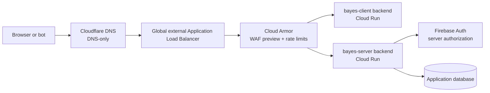

# Bayes Learning Platform — Public Abuse and Cost-Resistance Runbook

> **Purpose.** Complete this runbook before inviting a broad public audience to Bayes. It turns the current Cloudflare DNS → Google global Application Load Balancer → Cloud Run architecture into a bounded, observable public entry point. It is designed to make a single malicious browser, a misbehaving script, or an unexpected traffic burst unable to turn into unbounded Cloud Run or application-database spending.

> **Scope.** This is an operational hardening runbook. It does not claim that public services can be made impossible to attack, nor does it replace Firebase authorization, server-side input validation, or feature-specific quotas. Its job is to reduce blast radius, reject obvious abuse before Cloud Run, and make a problem visible and reversible quickly.

Current project: `bayes-institute`  
Primary region: `asia-south1`  
Public client: `https://www.bayesinstitute.com`  
Public API: `https://api.bayesinstitute.com`

---

## 1. Launch outcome and non-negotiable design

The public request path must become:

The controls have distinct purposes:

| Layer | Stops or limits | Does not replace |
| --- | --- | --- |
| Cloud Armor at the ALB | Request floods, obvious web attacks, and per-IP request-rate abuse before Cloud Run starts work | Authentication or per-user authorization |
| Cloud Run service-level maximum | Compute and concurrent database-connection expansion during a surge | A request quota; queued work can still be processed |
| Firebase Auth and FastAPI | Calls that do not have a valid identity or are not authorized for an operation | Rate limits, input validation, or feature quotas |
| Backend API and feature repository | Direct browser database access and provider-specific data models | Server-side authorization or spend limits |
| Budgets, anomalies, and alerts | Early warning and an explicit human response path | A guaranteed billing ceiling |

Do not rely on a single layer. In particular, a Cloud Billing budget alert does not automatically stop usage or charges. Google documents budgets as alerts unless a separate programmatic response or applicable spend-cap configuration is deliberately enabled.

## 2. Verified baseline — 2 October 2026

This table records the observed production state before this hardening work. Re-run the commands after every significant infrastructure change; do not assume a console setting survives a later deployment workflow.

| Area | Observed state | Required outcome in this runbook |
| --- | --- | --- |
| Cloud Run scaling | Both services have a **service-level** maximum of `3`; their current revision metadata still contains `autoscaling.knative.dev/maxScale: 20` | Keep the service-level maximum at `3`; the service-level cap is the effective public cost guard. The next workflow deployment should also converge the revision-level value to `3`. |
| Minimum instances | `0` | Keep `0` until measured latency justifies a paid warm instance. |
| Ingress | `all` for both services | Change to `internal-and-cloud-load-balancing` only after the custom-domain acceptance test passes. |
| ALB backends | `bayes-client-backend` and `bayes-server-backend` use regional serverless NEGs | Enable request logging and attach a separate Cloud Armor policy to each backend. |
| Backend logging | Disabled | Enable it before previewing or enforcing any Armor rule. |
| Cloud Armor | No policy exists or is attached | Create policies in preview, observe, then enforce the documented initial thresholds. |
| Public API surface today | `/health` and `/v1/authenticated-user`; the latter requires a Firebase bearer token | Keep unauthenticated endpoints dependency-free and inexpensive. Do not add a costly anonymous endpoint. |
| Application data access | No database provider is configured in the repository | Keep browser data access behind documented FastAPI contracts; add provider-specific persistence only in a server-side feature repository. |

Inspect the state with:

~~~powershell
$ProjectId = "bayes-institute"
$Region = "asia-south1"

gcloud run services describe bayes-client --region=$Region --project=$ProjectId `
  --format="yaml(metadata.annotations,spec.template.metadata.annotations,spec.template.spec.containerConcurrency)"
gcloud run services describe bayes-server --region=$Region --project=$ProjectId `
  --format="yaml(metadata.annotations,spec.template.metadata.annotations,spec.template.spec.containerConcurrency)"

gcloud compute backend-services describe bayes-client-backend --global --project=$ProjectId `
  --format="yaml(name,securityPolicy,logConfig,backends)"
gcloud compute backend-services describe bayes-server-backend --global --project=$ProjectId `
  --format="yaml(name,securityPolicy,logConfig,backends)"
gcloud compute security-policies list --project=$ProjectId
~~~

## 3. Ownership, sequencing, and safety rules

1. Run the infrastructure commands below as a human Google Cloud administrator, not as `bayes-github-deployer`. The human operator needs Compute Security Admin privileges to manage Cloud Armor and Network Admin-level access for the load-balancer components. Do not broaden the GitHub deployer account merely to make these commands work.
2. Complete [the custom-domain runbook](01_CLOUD_RUN_CLIENT_SERVER_DEPLOYMENT.md#step-11--publish-bayesinstitutecom-through-cloudflare-and-a-global-external-application-load-balancer) first. The certificate must be `ACTIVE` and both custom `/health` endpoints must return 200 before direct Cloud Run ingress is locked down.
3. Change one layer at a time, keep the corresponding validation output, and use Cloud Armor preview before enforcement. A bad rate rule can deny legitimate sign-in or API traffic.
4. Keep Cloudflare **DNS only** during this runbook. If Cloudflare proxying is enabled later, its proxy addresses alter what the Google load balancer sees as the source IP; revisit the rate-limit key and certificate configuration before treating current thresholds as valid.
5. Never put a real Firebase Admin JSON key, Cloudflare API token, or billing-account credential into the repository, Docker image, GitHub Actions variables, or this document.

## 4. Turn on evidence first: ALB logging and monitoring

Cloud Armor preview rules are useful only if the matching request logs can be inspected. Enable 100% load-balancer request logging during initial public launch; reduce the sample rate only after the traffic pattern is understood.

~~~powershell
gcloud compute backend-services update bayes-client-backend `
  --global --project=$ProjectId `
  --enable-logging --logging-sample-rate=1.0

gcloud compute backend-services update bayes-server-backend `
  --global --project=$ProjectId `
  --enable-logging --logging-sample-rate=1.0
~~~

In Cloud Monitoring, create an alert policy for each of these conditions. Send notifications to at least two people or two independent channels where possible.

| Signal | Initial alert condition | Why it matters |
| --- | --- | --- |
| ALB 4xx / 429 rate | Sustained rise above the normal baseline for 5 minutes | Shows enforced Armor limits or scanning; it is not automatically a service failure. |
| ALB 5xx rate | More than 1% for 5 minutes after an initial baseline exists | Indicates backend/application errors or capacity pressure. |
| Cloud Run request count | 5× expected normal rate for 5 minutes | Detects a flood that remains under one client’s rate limit. |
| Cloud Run instance count | Any sustained use of all 3 allowed instances | The cost and availability guard is active; investigate before raising it. |
| Cloud Run latency | p95 exceeds the agreed launch target | Distinguishes an attack from normal cold-start behavior. |
| Database operations | Unexpected increase against the feature baseline | Database operations can cost more than the incoming request count suggests. |
| Billing cost or anomaly | 20%, 50%, 80%, and 100% of the monthly public-launch budget | A decision point, not an automatic cap. |

Use the following log query while previewing policies; it is also the first query to run during an abuse event:

~~~text
resource.type="http_load_balancer"
jsonPayload.previewSecurityPolicy.name=("bayes-client-armor" OR "bayes-server-armor")
~~~

After enforcement, query `jsonPayload.enforcedSecurityPolicy.name` instead. Confirm actual field names in a returned request log before saving a dashboard query.

## 5. Add Cloud Armor in preview mode

Cloud Armor attaches to the ALB backend services, so disallowed traffic is rejected before a serverless NEG invokes Cloud Run. Create independent policies: the client has different normal traffic from the API, and a compromised browser should not consume the API’s quota.

### 5.1 Initial thresholds

These are deliberately conservative public-launch starting points, not permanent product limits. A throttle returns 429 only for the requests over the threshold; it is preferable to a ban while the site has little real traffic history.

| Backend / route class | Per-client key | Threshold | Action when exceeded | Rationale |
| --- | --- | --- | --- | --- |
| `bayes-client-backend` — `POST /api/auth/session` | Source IP | 10 requests / 60 seconds | 429 throttle | Session-cookie minting verifies a Firebase token and should never be hammered. |
| `bayes-client-backend` — all other requests | Source IP | 240 requests / 60 seconds | 429 throttle | Permits normal page assets/navigation while limiting a simple browser loop. |
| `bayes-server-backend` — `/health` | Source IP | 30 requests / 60 seconds | 429 throttle | Allows monitoring but prevents health checks becoming the highest-cost public route. |
| `bayes-server-backend` — all other API requests | Source IP | 60 requests / 60 seconds | 429 throttle | The API is the route that will later drive database work and expensive features. |

The policies use `IP`, not an arbitrary `X-Forwarded-For` header. In the current DNS-only topology, the global load balancer observes the client source address. Do not change this key casually: client identity choices determine how attackers can split or spoof rate-limit buckets.

### 5.2 Create and attach the policies

~~~powershell
gcloud compute security-policies create bayes-client-armor `
  --project=$ProjectId `
  --description="Preview then enforce public client rate limits"

gcloud compute security-policies create bayes-server-armor `
  --project=$ProjectId `
  --description="Preview then enforce public API rate limits"

# Client: expensive session creation first, then the all-request guard.
gcloud compute security-policies rules create 1000 `
  --security-policy=bayes-client-armor `
  --expression="request.path == '/api/auth/session'" `
  --action=throttle --rate-limit-threshold-count=10 `
  --rate-limit-threshold-interval-sec=60 `
  --conform-action=allow --exceed-action=deny-429 `
  --enforce-on-key=IP --preview `
  --description="Preview: session endpoint per-IP throttle"

gcloud compute security-policies rules create 2000 `
  --security-policy=bayes-client-armor `
  --src-ip-ranges="*" `
  --action=throttle --rate-limit-threshold-count=240 `
  --rate-limit-threshold-interval-sec=60 `
  --conform-action=allow --exceed-action=deny-429 `
  --enforce-on-key=IP --preview `
  --description="Preview: client general per-IP throttle"

# Server: health remains cheap but bounded; all other API requests are tighter.
gcloud compute security-policies rules create 1000 `
  --security-policy=bayes-server-armor `
  --expression="request.path == '/health'" `
  --action=throttle --rate-limit-threshold-count=30 `
  --rate-limit-threshold-interval-sec=60 `
  --conform-action=allow --exceed-action=deny-429 `
  --enforce-on-key=IP --preview `
  --description="Preview: health endpoint per-IP throttle"

gcloud compute security-policies rules create 2000 `
  --security-policy=bayes-server-armor `
  --src-ip-ranges="*" `
  --action=throttle --rate-limit-threshold-count=60 `
  --rate-limit-threshold-interval-sec=60 `
  --conform-action=allow --exceed-action=deny-429 `
  --enforce-on-key=IP --preview `
  --description="Preview: API general per-IP throttle"

gcloud compute backend-services update bayes-client-backend `
  --global --project=$ProjectId --security-policy=bayes-client-armor

gcloud compute backend-services update bayes-server-backend `
  --global --project=$ProjectId --security-policy=bayes-server-armor
~~~

Do not add a blanket deny rule. A new Cloud Armor policy has a default allow rule, which intentionally keeps the preview phase non-disruptive.

### 5.3 Observe before enforcement

Leave the policy in preview for at least 24 hours of representative traffic and at least one manual sign-in cycle. Review the logs for users who would have matched the rules. Pay particular attention to shared school, library, and mobile-carrier IP addresses; raise only the affected threshold if normal users would be denied.

Verify the attachment and rules:

~~~powershell
gcloud compute backend-services describe bayes-client-backend --global --project=$ProjectId `
  --format="yaml(name,securityPolicy,logConfig)"
gcloud compute backend-services describe bayes-server-backend --global --project=$ProjectId `
  --format="yaml(name,securityPolicy,logConfig)"
gcloud compute security-policies rules list --security-policy=bayes-client-armor --project=$ProjectId
gcloud compute security-policies rules list --security-policy=bayes-server-armor --project=$ProjectId
~~~

### 5.4 Enforce the tuned thresholds

- [ ] **Todo (current state: preview mode):** Review Cloud Armor preview logs for representative client navigation, sign-in, API calls, and shared-IP traffic; tune the documented Armor thresholds, then disable preview on the rate rules and verify requests above each threshold return 429. Record the observed results before enforcement.

After review, turn off preview on each rule. Do not silently change a threshold at the same time; make one measured decision per deployment record.

~~~powershell
gcloud compute security-policies rules update 1000 --security-policy=bayes-client-armor --project=$ProjectId --no-preview
gcloud compute security-policies rules update 2000 --security-policy=bayes-client-armor --project=$ProjectId --no-preview
gcloud compute security-policies rules update 1000 --security-policy=bayes-server-armor --project=$ProjectId --no-preview
gcloud compute security-policies rules update 2000 --security-policy=bayes-server-armor --project=$ProjectId --no-preview
~~~

Cloud Armor rate limiting is per backend. It is an edge control, not an account quota: a distributed attack can use many IP addresses, which is why the following Firebase, application, and cost controls are still mandatory. Google recommends previewing rate rules and reviewing request logs before enforcement.

### 5.5 Add WAF rules only in preview and only after rate limiting is understood

Cloud Armor preconfigured WAF rules can help with common SQL injection and XSS probes, but they can also create false positives for lesson text, URLs, or future rich-content features. Add candidate WAF rules in preview first, starting at low sensitivity, and promote only after reviewing actual matches. Never treat a WAF rule as a substitute for parameterized queries, output encoding, or server-side validation.

## 6. Prevent bypass of the protected entry point

Once these all pass:

1. `https://www.bayesinstitute.com/health` returns 200.
2. `https://api.bayesinstitute.com/health` returns 200.
3. The Certificate Manager certificate is `ACTIVE`.
4. Cloud Armor policies are attached and backend logs are flowing.

follow Step 11.7 of the domain runbook. In the same commit:

- change both Cloud Run deployments from `--ingress all` to `--ingress internal-and-cloud-load-balancing`; and
- change CD smoke tests from the direct `run.app` URLs to `${CLIENT_ORIGIN}/health` and `${SERVER_ORIGIN}/health`.

This is essential. Until direct public ingress is restricted, an attacker can call a `run.app` URL and bypass the ALB, Cloud Armor policy, ALB logging, and any future Cloud Armor WAF rule. After the change, public `run.app` requests are expected to fail; only the ALB may reach Cloud Run.

Keep `--allow-unauthenticated`. It permits the ALB to forward public browser traffic; Firebase verification and application authorization still protect API operations.

## 7. Keep Cloud Run bounded and cheap

Cloud Run limits are a second line of defense after Cloud Armor. They cannot eliminate cost, but they cap parallel compute expansion and bound downstream connection pressure.

1. Keep `--min 0` for both services during public launch.
2. Keep the **service-level** maximum at `3` for both services. Do not raise it to solve a traffic spike until the source is understood and the expected cost is acceptable.
3. Retain the current concurrency values initially: `40` for the lightweight Next.js client and `20` for the FastAPI API. Lower API concurrency if a future endpoint is CPU-heavy or creates too many database operations; validate under load before changing it.
4. Ensure future workflow edits retain `--min 0 --max 3`, `--cpu`, memory, concurrency, and request timeout values explicitly. A console-only change can drift from the next GitHub deployment.
5. Give expensive operations short, explicit timeouts and a bounded request body before they invoke a database, storage, a third-party API, or any future model provider. This is a code requirement for the feature that introduces the cost, not a health-check concern.

The service-level maximum is the stronger steady-state guard in the observed configuration. The stale revision-level `maxScale: 20` should converge to `3` on the next normal deployment; do not raise the service-level setting to match it.

## 8. Firebase, database access, and feature gates

### 8.1 Firebase Authentication

Before public invitation, in Firebase Authentication:

- enable only the sign-in providers the product intentionally supports;
- add `bayesinstitute.com` and `www.bayesinstitute.com` to Authorized domains;
- remove unused test/development OAuth redirect URIs and test users where applicable;
- require verified email for any future action that creates costly work or changes ownership; and
- keep FastAPI deriving the user identity solely from a verified Firebase token, never from a browser-supplied user ID, role, course, or entitlement.

The existing FastAPI `/v1/authenticated-user` boundary already verifies a bearer token. Every future API route must use the same dependency or an equally strict, tested replacement.

### 8.2 Request attestation is a separate, API-level decision

For a route whose risk justifies it, add request attestation at the API boundary and monitor it before enforcement. It complements, but never replaces, Firebase Authentication, application authorization, rate limits, and feature quotas.

Roll it out in this order:

1. Define the route-level threat model and choose an appropriate attestation provider.
2. Observe legitimate production traffic before enforcement.
3. Verify attestations at the FastAPI boundary only for the selected routes.
4. Test each sign-in provider, session refresh, and sign-out flow before enforcement.

### 8.3 Database access is an API boundary

The browser must not import a database SDK, use database rules as application authorization, or query application data directly. It receives application data only from documented FastAPI contracts. Each protected route verifies the Firebase identity, authorizes the operation, calls the feature service, and returns a domain-shaped response.

Provider-specific persistence belongs in a server-side repository or integration owned by that feature. Keep database records, query syntax, provider identifiers, connection details, and migrations out of API contracts. Firestore may be introduced as a temporary server-side provider, but a later Cloud SQL migration must replace only that repository/integration and its runtime configuration—not browser code or API contracts.

The removed Firestore Rules source and deployment workflow are no longer part of this repository. Removing them does not change any live Google Cloud release or IAM binding. A cloud administrator must separately inventory and retire unused Firestore resources and permissions; do not remove a live database or broaden its access as an incidental repository cleanup.

### 8.4 Endpoint cost classification is required before each feature

Every new public route must be classified in its design/PR before it is deployed:

| Class | Typical examples | Required controls |
| --- | --- | --- |
| Cheap | `/health`, static landing content | No database or third-party work; edge rate limit only. |
| Identity | Session create/delete, sign-in callback | Same-origin protection, Firebase token verification, low IP rate limit, audit logging. |
| Learner read | Profile, progress, published lesson | Authentication, ownership checks, pagination, read-cost estimate, per-user limit when needed. |
| Learner write | Submit answer, update progress | Authentication, authorization, idempotency key or attempt constraint, per-user limit, bounded database reads/writes. |
| Expensive | Upload, search, reporting, AI, exports, payments | Authentication, per-user/day quota, payload size cap, timeout, concurrency cap, cost estimate, audit event, and explicit product-owner approval. |

The edge can rate-limit an IP but cannot reliably identify a Firebase user before authentication. Per-user quotas, idempotency, and "one submission per attempt" constraints are application/data-model work and must be implemented with the feature itself.

## 9. Budget, quota, and incident controls

### 9.1 Choose an explicit public-launch budget

Set a monthly amount that you are genuinely willing to spend during public launch. Then configure budget notifications at 20%, 50%, 80%, and 100% of that amount, including forecasted spend. Send them to an address monitored outside the project owner’s inbox.

Also enable cost anomaly notifications. If alerts are not watched promptly, connect the budget and anomaly notifications to a Pub/Sub topic and an independent human notification channel. Programmatic budget actions are possible, but an automatic billing disablement is an emergency kill switch that takes the entire product down; do not enable it without an explicit recovery procedure and owner approval.

**Current launch control.** A monthly `₹1,000` budget named `Bayes public-launch monthly ceiling` is scoped only to this project. It alerts on both actual and forecasted spend at 20%, 50%, 80%, and 100%. It has no automated billing-disablement or workload action. The current email channel belongs to the project owner, so an independent recipient and cost-anomaly notification configuration remain launch gates rather than being represented as complete.

### 9.2 Apply quota intentionally

In Google Cloud Console, review project quotas for Cloud Run, Artifact Registry, Cloud Logging, and each database, AI, or storage provider a feature actually uses. Keep quotas comfortably above ordinary launch traffic but below a clearly unacceptable accidental-spend level. Record each quota decision, the intended feature load, and the recovery owner.

Do not use a quota reduction that makes deployment, login, or incident recovery impossible. The goal is a controlled failure mode (429 or temporary unavailability), not a surprise production outage.

| Service | Current launch decision | Intended feature load | Recovery owner |
| --- | --- | --- | --- |
| Cloud Run, `asia-south1` | Do not reduce the broad regional CPU or memory quota. The two service-level maximums of `3` bound public compute to six 1-vCPU / 512-MiB instances, while preserving deployment and recovery headroom. | Next.js client and FastAPI API only. | Project owner |
| Application database | Do not provision or tune a database quota until a server-side persistence feature is approved. Choose provider limits from the feature’s measured read/write and connection requirements. | No direct browser data feature. | Project owner |
| Artifact Registry | Do not reduce API-rate quotas. Preserve the ability to build, push, and roll back immutable release images. | Two container images per release. | Project owner |
| Cloud Logging | Keep the 30-day default-log retention and 400-day required-audit retention. Revisit sampling only after a normal traffic baseline. | ALB and security investigation during launch. | Project owner |

### 9.3 Keep logs inexpensive and useful

Use 100% ALB logging during initial traffic and Armor tuning. After a normal baseline exists, retain security-policy and error visibility while choosing an appropriate sample rate. Never log Firebase bearer tokens, session cookies, authorization headers, database records, student answers, or raw request bodies.

**Current launch control.** Both ALB backends have logging enabled with a sample rate of `1.0`. The application does not emit request headers, tokens, cookies, request bodies, database data, or learner answers to logs.

## 10. Abuse response playbook

Use this sequence for an active request spike:

1. Confirm whether the ALB, Cloud Run, or database metric is rising; do not assume a social-media spike is malicious.
2. Check Cloud Armor logs for the top matching rule, source IPs, paths, response codes, and whether traffic is previewed or enforced.
3. If one source is clearly abusive, add a narrow, time-bounded deny rule at a priority above rate limits. Document the source, timestamp, evidence, and expiry plan.
4. If many sources are abusive, temporarily lower the relevant enforced rate threshold rather than creating a large IP block list.
5. If the API is approaching all three instances or creates unexpected database operations, disable the affected expensive feature or endpoint at the application layer. If necessary, lower the Cloud Run service maximum as a temporary availability-versus-cost decision.
6. Check billing and anomaly notifications, preserve logs, and record the incident before relaxing any rule.
7. Remove temporary blocks only after the underlying feature/rate policy has been corrected and tested.

Never respond to a suspected attack by widening CORS, granting a broad IAM role, exposing a service-account key, or raising Cloud Run maximum instances blindly.

## 11. Public-launch acceptance checklist

Do not mark the platform public-ready until every applicable item is checked.

- [ ] The managed certificate is `ACTIVE`; root, `www`, and `api` DNS records are DNS-only and resolve to `34.117.158.133`.
- [ ] `https://www.bayesinstitute.com/health` and `https://api.bayesinstitute.com/health` return 200.
- [ ] ALB request logging is enabled for both backends and is visible in Cloud Logging.
- [ ] `bayes-client-armor` and `bayes-server-armor` are attached to the matching backend services.
- [ ] Cloud Armor preview logs were reviewed for representative client navigation, sign-in, API calls, and a shared-IP scenario.
- [ ] Tuned Cloud Armor rate rules are enforced and return 429 above their threshold.
- [ ] Cloud Run remains at service-level minimum `0` and maximum `3`; no deployment workflow can silently remove these bounds.
- [ ] The production workflow uses `internal-and-cloud-load-balancing` ingress and smoke-tests the custom domains, not direct `run.app` URLs.
- [ ] Firebase authorized domains/providers are reviewed; every protected API route verifies Firebase identity and authorizes the action.
- [ ] Every application-data path uses a documented backend API contract; client code has no database SDK or direct database query.
- [ ] Monthly budget, forecast alerts, anomaly notifications, and their recipients have been tested.
- [ ] A human owner has practiced the abuse-response playbook and knows how to inspect, tighten, and roll back an Armor rule.

## 12. References

- [Cloud Armor rate limiting overview](https://cloud.google.com/armor/docs/rate-limiting-overview)
- [Configure Cloud Armor rate limiting](https://cloud.google.com/armor/docs/configure-rate-limiting)
- [Cloud Run maximum instances and cost safeguards](https://cloud.google.com/run/docs/configuring/max-instances)
- [Set up a global external Application Load Balancer with Cloud Run](https://cloud.google.com/load-balancing/docs/https/setup-global-ext-https-serverless)
- [Cloud Billing budgets and alerts](https://cloud.google.com/billing/docs/how-to/budgets)
- [Cloud Billing programmatic notifications](https://cloud.google.com/billing/docs/how-to/budgets-programmatic-notifications)
