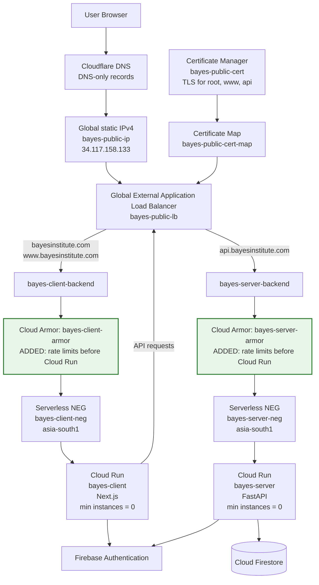
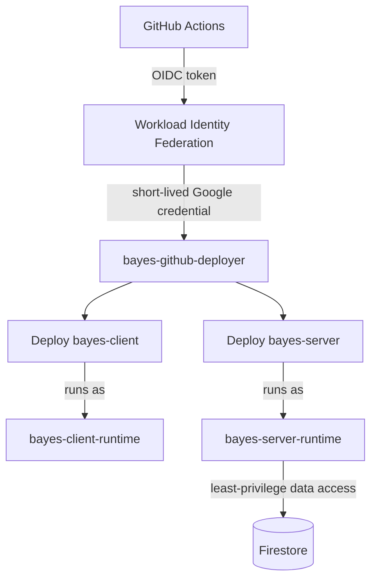
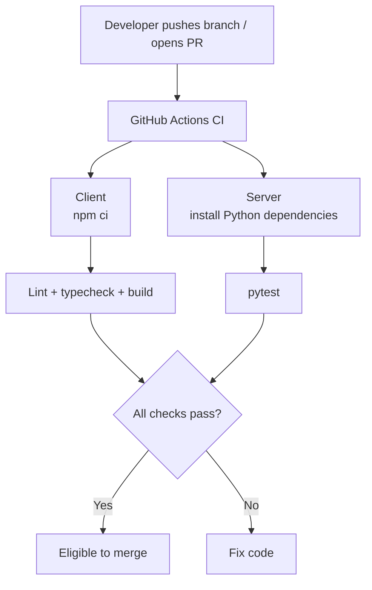
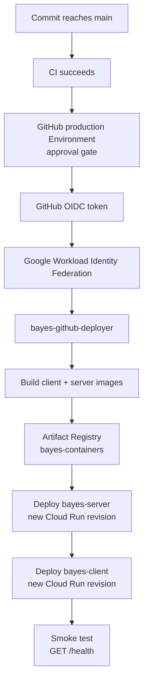
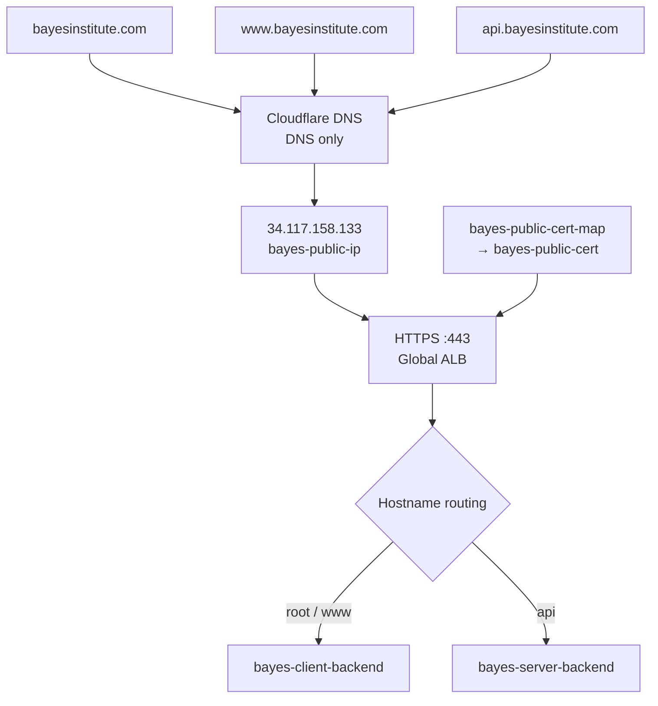
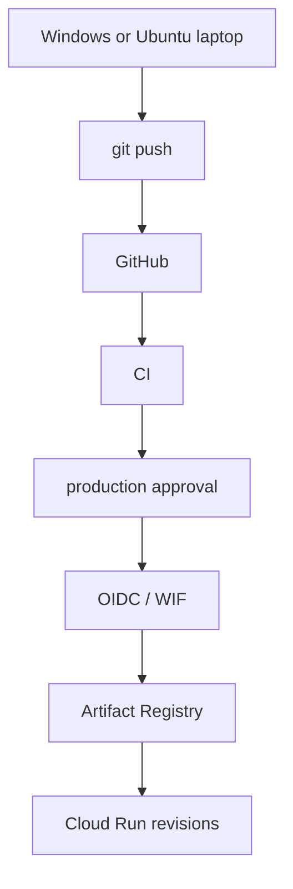
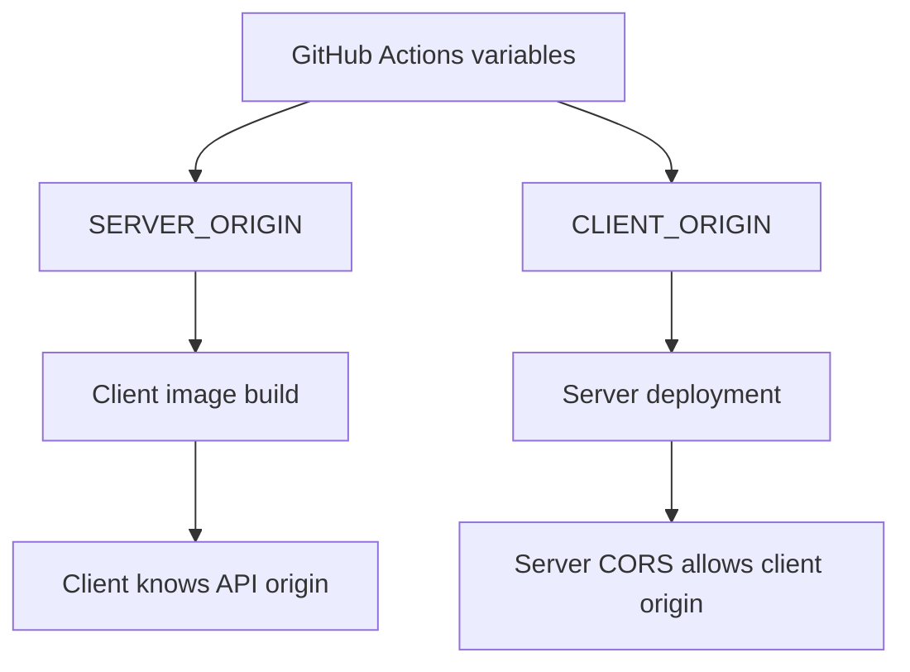
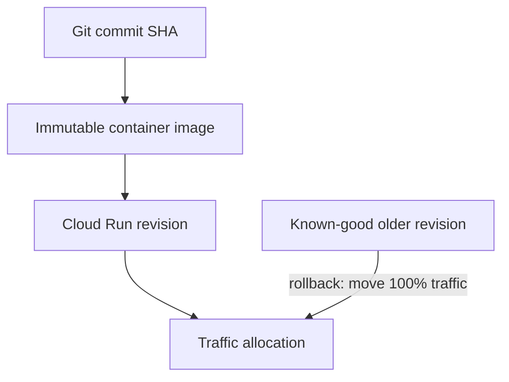
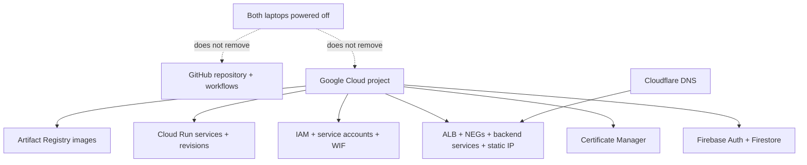
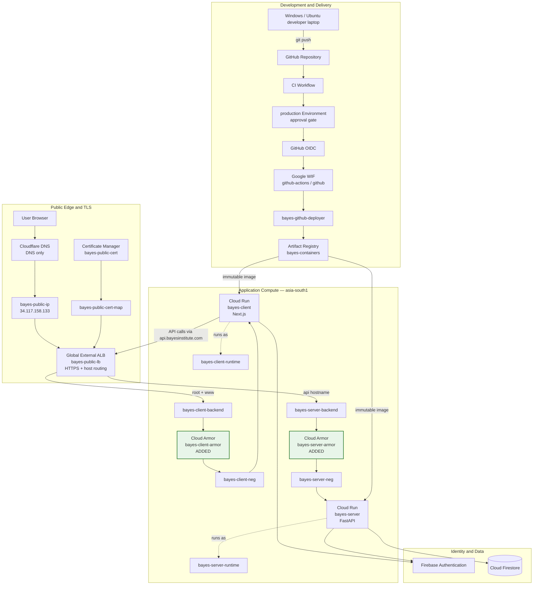

# Bayes Learning Platform — Cloud Architecture, What We Built, and New-Machine Setup

> **Purpose.** This document is the mental model and operational handoff for the infrastructure created for the Bayes Learning Platform. It separates **cloud resources that were created once** from **machine-local setup that must be repeated on every development laptop**.
>
> Current production project: `bayes-institute`<br>
> Primary region: `asia-south1` (Mumbai)<br>
> Canonical client origin: `https://www.bayesinstitute.com`<br>
> Canonical API origin: `https://api.bayesinstitute.com`

> **Public-launch hardening update (3 October 2026).** The original delivery and public-routing architecture remains in place. Cloud Armor policies now sit on the two load-balancer backends, load-balancer request logging provides evidence for them, and Cloud Run accepts public traffic only through that load balancer. Read [Public Abuse and Cost Hardening](02_bayes-public-abuse-and-cost-hardening.md) as the next chapter: it explains the new controls, their limits, and the ongoing decisions they require.

---

## 1. Executive mental model

At the end of the setup, we did **not** merely deploy two applications. We built a small production delivery platform around them.

The two applications are:

- **`bayes-client`** — the Next.js application.
- **`bayes-server`** — the FastAPI business API.

They are packaged as independent Docker images, stored in Artifact Registry, and deployed independently to Cloud Run. Both can scale to zero. This separation gives independent deployments, logs, scaling, memory, revisions, and failure isolation.

Around those applications we built four supporting layers:

1. **Identity and security** — runtime service accounts, a deployment service account, IAM, and GitHub Workload Identity Federation.
2. **Software delivery** — GitHub CI/CD and Artifact Registry.
3. **Public networking** — serverless NEGs, backend services, a global Application Load Balancer, a fixed global IP, host-based routing, HTTP-to-HTTPS redirect, and (after public-launch hardening) backend-specific Cloud Armor policies plus request logging.
4. **Domain and TLS** — Cloudflare DNS plus a Google-managed Certificate Manager certificate and certificate map.

The resulting system is therefore better understood as:



The important idea is that **the load balancer does not run your application**. Cloud Run does. The load balancer is the public entrance and router.

---

## 2. The request path, step by step

### 2.1 A user opens the website

The browser requests:

```text
https://www.bayesinstitute.com
```

Cloudflare is currently acting as the authoritative DNS provider. Its record resolves the hostname directly to the fixed Google load-balancer IP:

```text
www.bayesinstitute.com
        ↓ DNS
34.117.158.133
```

The record is **DNS only**, so Cloudflare is not currently an HTTP reverse proxy in the request path.

### 2.2 Google terminates HTTPS

The global Application Load Balancer accepts the connection on port 443. The Google-managed certificate proves the identity of:

- `bayesinstitute.com`
- `www.bayesinstitute.com`
- `api.bayesinstitute.com`

Certificate Manager owns `bayes-public-cert`. Because this certificate uses the newer Certificate Manager model, it is attached to the HTTPS proxy through `bayes-public-cert-map` and hostname-specific map entries.

### 2.3 The load balancer decides which application receives the request

The URL map uses the hostname:

```text
www.bayesinstitute.com ──► bayes-client-backend
bayesinstitute.com     ──► bayes-client-backend
api.bayesinstitute.com ──► bayes-server-backend
```

The client backend is the **default backend**, while `api.bayesinstitute.com` has an explicit host rule for the server backend.

### 2.4 Backend service → serverless NEG → Cloud Run

A backend service is the load balancer's logical backend configuration. Cloud Run itself is represented to the load balancer by a **serverless Network Endpoint Group (NEG)**.

Therefore the client path is:

```text
bayes-client-backend
        ↓
bayes-client-neg
        ↓
bayes-client Cloud Run service
```

and the API path is:

```text
bayes-server-backend
        ↓
bayes-server-neg
        ↓
bayes-server Cloud Run service
```

A serverless NEG is essentially the adapter that tells Google's load-balancing infrastructure, **“this backend is this Cloud Run service in this region.”** It is not a VM, subnet, or additional running server.

### 2.5 Cloud Run starts an instance only when necessary

Both services use request-based Cloud Run and have minimum instances set to zero. When idle, they can scale down to zero. When a request arrives, Cloud Run starts or reuses an instance and sends the request to port `8080` inside the container.

This explains why the first request after a long idle period can be slower: it can incur a cold start.

---

## 3. What every cloud component is doing

| Component | Resource | Why it exists |
|---|---|---|
| Google Cloud project | `bayes-institute` | Administrative and billing boundary shared with Firebase. |
| Firestore | Firebase/Google project database | Durable application/student data. |
| Firebase Authentication | Same Firebase project | User identity and sign-in. |
| Artifact Registry | `bayes-containers` | Stores immutable Docker images built from the client and server. |
| Client runtime identity | `bayes-client-runtime@...` | Identity used by the running Next.js Cloud Run service. |
| Server runtime identity | `bayes-server-runtime@...` | Identity used by FastAPI; receives the permissions the API actually needs, such as Firestore access. |
| GitHub deployer identity | `bayes-github-deployer@...` | Deployment-only identity used by GitHub Actions. It is separate from runtime identities. |
| Workload Identity Pool | `github-actions` | Trust boundary allowing external GitHub OIDC identities to exchange tokens for Google credentials. |
| WIF provider | `github` | Trusts GitHub's OIDC issuer and restricts trust to `bayes-institute/bayes-learning-platform`. |
| Cloud Run | `bayes-client` | Runs the Next.js container. |
| Cloud Run | `bayes-server` | Runs the FastAPI container. |
| Serverless NEG | `bayes-client-neg` | Connects the global load balancer to `bayes-client` in `asia-south1`. |
| Serverless NEG | `bayes-server-neg` | Connects the global load balancer to `bayes-server` in `asia-south1`. |
| Backend service | `bayes-client-backend` | Load-balancer backend configuration for the client NEG. |
| Backend service | `bayes-server-backend` | Load-balancer backend configuration for the API NEG. |
| Cloud Armor client policy | `bayes-client-armor` | **Added for public launch.** Per-IP rate limits for client traffic, including the session-creation endpoint, before Cloud Run is invoked. |
| Cloud Armor API policy | `bayes-server-armor` | **Added for public launch.** Separate per-IP rate limits for `/health` and API traffic before Cloud Run is invoked. |
| Backend request logging | Both backend services | **Added for public launch.** Provides the request evidence used to tune and investigate the Armor policies. |
| Static IP | `bayes-public-ip` = `34.117.158.133` | Stable public address to which DNS points. |
| Global external ALB | `bayes-public-lb` | Public HTTP/HTTPS entrance, hostname router, and HTTP→HTTPS redirect layer. |
| Managed certificate | `bayes-public-cert` | Google-managed TLS for root, `www`, and `api`. |
| Certificate map | `bayes-public-cert-map` | Connects incoming SNI hostnames to the Certificate Manager certificate on the HTTPS proxy. |
| Cloudflare DNS | `@`, `www`, `api` | Resolves all production hostnames to the global load-balancer IP. |
| GitHub `production` environment | `production` | Deployment approval/protection gate. |

---

## 4. Why there are three service accounts

One of the most important architectural choices was **separating deployment identity from runtime identity**.



### `bayes-github-deployer`

This account exists to **change infrastructure deployments**, not to serve user requests. It can push images/deploy Cloud Run and attach the designated runtime identities. GitHub receives short-lived credentials through WIF; no Google service-account JSON needs to be stored in GitHub.

### `bayes-client-runtime`

This is the identity of the running client container. It should not receive broad project permissions simply because the deployer has them.

### `bayes-server-runtime`

This is the identity of the running API. When the server needs Firestore, IAM is granted here (for example `roles/datastore.user`) rather than to the deployer.

This is the principle of least privilege in practical form: **the actor that deploys software and the software that handles requests are different security principals.**

The Firebase-generated `firebase-adminsdk-fbsvc@...` service account also exists, primarily relevant to Firebase Admin/service-account-key workflows, but it is not the GitHub deployment identity and should not be substituted for the purpose-built runtime/deployer accounts.

---

## 5. CI and CD are two different workflows

### 5.1 Continuous Integration (CI)

CI answers:

> **Is this code safe enough to merge?**

It does not need Google deployment credentials and should not deploy anything.



### 5.2 Continuous Deployment (CD)

CD answers:

> **How does an approved commit become the running production system?**



Images are tagged with the Git commit SHA. That matters because a deployment is tied to an immutable code version rather than a mutable `latest` image.

---

## 6. DNS, TLS, and routing are another workflow

The domain setup was not application deployment. It was the creation of a stable **public ingress plane**.



### Why the fixed IP?

DNS needs a stable destination. Cloud Run-generated service URLs are not the same thing as a single stable public IP used by this ALB design. `bayes-public-ip` gives DNS a durable target.

### Why Certificate Manager?

TLS certificates prove to browsers that the server is authorized for the requested hostname. Google manages issuance and renewal. The certificate covers all three public hostnames.

### Why a certificate map?

The newer Certificate Manager certificate is not the old Compute Engine `sslCertificates` resource. A certificate map is attached to the HTTPS target proxy and maps hostnames/SNI to Certificate Manager certificates. This is why the correct inspection command is:

```bash
gcloud certificate-manager certificates describe bayes-public-cert \
  --location=global \
  --project=bayes-institute
```

and **not**:

```text
gcloud compute ssl-certificates describe bayes-public-cert
```

### Why were Cloudflare records set to DNS only?

During certificate authorization, Google needed the hostnames to resolve directly to the load balancer. Cloudflare proxying previously exposed Cloudflare IP addresses to Google's certificate authority, which caused authorization failures such as `RESOLVED_TO_NOT_SERVING`. DNS-only mode makes Cloudflare the DNS authority without placing Cloudflare's HTTP proxy in front of Google.

---

## 7. One-time cloud provisioning vs per-laptop setup

This distinction is the most important operational takeaway.

### 7.1 One-time / cloud-state operations — **do not repeat on Ubuntu**

These commands created persistent resources in Google Cloud or GitHub. Once the resource exists, it exists independently of the Windows laptop that created it.

Do **not** rerun these just because you move to another computer:

```text
Creating/enabling the Firebase/Google Cloud project
Creating Firestore
Choosing Firestore location
Enabling project APIs (unless a genuinely new API is needed)
Creating bayes-containers Artifact Registry
Creating Artifact Registry cleanup policies
Creating bayes-client-runtime
Creating bayes-server-runtime
Granting runtime IAM roles
Creating bayes-github-deployer
Granting deployer IAM roles
Creating the WIF pool github-actions
Creating the WIF provider github
Granting roles/iam.workloadIdentityUser
Creating GitHub repository variables
Creating/protecting the GitHub production Environment
Creating bayes-client / bayes-server Cloud Run services
Creating bayes-client-neg / bayes-server-neg
Creating bayes-client-backend / bayes-server-backend
Reserving bayes-public-ip
Creating bayes-public-cert
Creating bayes-public-cert-map and its entries
Creating bayes-public-lb
Creating HTTP/HTTPS forwarding/routing configuration
Changing Cloudflare @ / www / api DNS records
```

These are **cloud resources**, not Windows configuration.

Running a `create` command a second time usually results in an “already exists” error at best; at worst, creating a differently named duplicate can make the architecture confusing and add cost.

### 7.2 Per-machine setup — repeat on every laptop

A new Ubuntu laptop does need local tools, authentication, repository checkout, dependencies, and local environment configuration.

The machine should know:

```text
Who am I?                    → gcloud authentication
Which GCP project?           → gcloud config
Which default Cloud Run region? → gcloud config
Where is the source code?    → git clone
How does local Firebase Admin authenticate? → ADC or local credential file
What are local app settings? → client/.env.local + server/.env
```

It does **not** need to recreate the cloud.

---

## 8. Ubuntu laptop bootstrap — recommended sequence

The following is the practical new-machine checklist.

### 8.1 Install local tooling

Install the tools required by the repository and workflow:

- Git
- Google Cloud CLI (`gcloud`)
- Node.js version required by the repository
- Python version required by the repository
- Docker, if you want local container builds/tests
- GitHub CLI (`gh`), optional but useful

Check versions:

```bash
git --version
gcloud --version
node --version
npm --version
python3 --version
docker --version
```

Use the versions currently declared by the repository/Dockerfiles/workflows as the source of truth. Do not blindly reproduce an older version from this historical runbook if the codebase has since upgraded.

### 8.2 Clone the repository

```bash
git clone https://github.com/bayes-institute/bayes-learning-platform.git
cd bayes-learning-platform
```

### 8.3 Authenticate the human operator to Google Cloud

```bash
gcloud auth login
```

Sign in with the human Google account authorized for `bayes-institute`.

Then configure the local CLI:

```bash
gcloud config set account sagarudasibackup@gmail.com
gcloud config set project bayes-institute
gcloud config set run/region asia-south1
```

Verify:

```bash
gcloud config list
```

Expected essentials:

```text
[core]
account = sagarudasibackup@gmail.com
project = bayes-institute

[run]
region = asia-south1
```

These `gcloud config set ...` commands are **per-machine configuration**, so running them on Ubuntu is correct.

### 8.4 Configure local Application Default Credentials only if your local app uses ADC

`gcloud auth login` authenticates the **gcloud CLI**. Application Default Credentials are a separate mechanism used by Google/Firebase client libraries running locally.

If you want user-based local ADC:

```bash
gcloud auth application-default login
```

If your code instead uses the downloaded Firebase service-account JSON, keep that JSON outside source control and set an absolute Linux path, for example:

```bash
export GOOGLE_APPLICATION_CREDENTIALS="$HOME/.config/bayes/bayes-institute-firebase-adminsdk.json"
```

or place the equivalent value in the ignored local environment file if the application's loader expects it there.

**Use one intentional local credential strategy.** Do not copy the JSON into Git, a Docker image, or GitHub Actions.

### 8.5 Create/fill local environment files

The repository's local-development contract uses:

```text
client/.env.local
server/.env
```

Typical local origins are:

```env
# client/.env.local
NEXT_PUBLIC_SITE_URL=http://localhost:3000
NEXT_PUBLIC_SERVER_API_ORIGIN=http://localhost:8000
```

and:

```env
# server/.env
APPLICATION_ENV=development
SERVER_ALLOWED_CLIENT_ORIGINS=http://localhost:3000
FIREBASE_PROJECT_ID=bayes-institute
```

Add the Firebase browser configuration to the client when testing Firebase sign-in. Configure one working Firebase Admin credential method in both processes when testing protected sessions/token verification.

### 8.6 Install application dependencies

Follow the repository README/package files. Conceptually:

```bash
cd client
npm ci
cd ../server
python3 -m venv .venv
source .venv/bin/activate
pip install -r requirements.txt
cd ..
```

Use the actual repository tooling if it has moved to another Python package manager.

### 8.7 Start local development

The runbook defines a Linux startup script:

```bash
./scripts/start-dev.sh
```

Then verify the local health endpoints expected by the repository.

---

## 9. Commands that are safe/useful from any laptop because they **inspect** cloud state

These commands do not recreate infrastructure; they query what already exists.

### Project and account

```bash
gcloud auth list
gcloud config list
gcloud projects describe bayes-institute
```

### Cloud Run

```bash
gcloud run services list --region=asia-south1 --project=bayes-institute

gcloud run services describe bayes-client \
  --region=asia-south1 \
  --project=bayes-institute

gcloud run services describe bayes-server \
  --region=asia-south1 \
  --project=bayes-institute
```

### Artifact Registry

```bash
gcloud artifacts repositories describe bayes-containers \
  --location=asia-south1 \
  --project=bayes-institute
```

### Service accounts

```bash
gcloud iam service-accounts list --project=bayes-institute
```

### Workload Identity Federation

```bash
gcloud iam workload-identity-pools list \
  --location=global \
  --project=bayes-institute

gcloud iam workload-identity-pools providers describe github \
  --workload-identity-pool=github-actions \
  --location=global \
  --project=bayes-institute
```

The provider condition should restrict the repository to:

```text
assertion.repository=='bayes-institute/bayes-learning-platform'
```

### Serverless NEGs

```bash
gcloud compute network-endpoint-groups list \
  --filter="region:asia-south1" \
  --project=bayes-institute
```

### Backend services

```bash
gcloud compute backend-services list \
  --global \
  --project=bayes-institute
```

### Load-balancer static IP

```bash
gcloud compute addresses describe bayes-public-ip \
  --global \
  --project=bayes-institute \
  --format="value(address)"
```

Expected at the time of this document:

```text
34.117.158.133
```

### Certificate Manager

```bash
gcloud certificate-manager certificates describe bayes-public-cert \
  --location=global \
  --project=bayes-institute

gcloud certificate-manager maps describe bayes-public-cert-map \
  --location=global \
  --project=bayes-institute

gcloud certificate-manager maps entries list \
  --map=bayes-public-cert-map \
  --location=global \
  --project=bayes-institute
```

### Load-balancer wiring

```bash
gcloud compute forwarding-rules list \
  --global \
  --project=bayes-institute

gcloud compute target-https-proxies list \
  --global \
  --project=bayes-institute

gcloud compute url-maps list \
  --global \
  --project=bayes-institute
```

These are useful on Ubuntu because they let you reconstruct your mental model from live cloud state without changing it.

---

## 10. What happens when you deploy from the Ubuntu laptop?

Normally, **you should not manually run `gcloud run deploy` from the laptop** for ordinary production releases.

The normal production workflow is:



Your laptop only needs Git access to push the code. GitHub Actions performs the privileged deployment through WIF.

That is a major benefit of the architecture: **production deployment is not coupled to whichever laptop happens to contain a Google service-account key.**

For a deliberate deployment without code changes:

```bash
git checkout main
git pull origin main
git commit --allow-empty -m "chore: trigger production deployment"
git push origin main
```

Then approve the GitHub `production` Environment deployment if the workflow requires approval.

---

## 11. Production configuration flow

The production origins are GitHub Actions variables:

```text
CLIENT_ORIGIN=https://www.bayesinstitute.com
SERVER_ORIGIN=https://api.bayesinstitute.com
```

Changing these variables alone does not modify an existing Cloud Run revision. A new deployment is required because the production workflow uses them while building/configuring the services.

Conceptually:



This keeps the browser's API target and the API's allowed browser origin synchronized through the deployment pipeline.

---

## 12. Health checks and what they prove

Both applications expose:

```text
GET /health
```

The expected responses are conceptually:

```json
{"status":"ok","service":"client"}
```

and:

```json
{"status":"ok","service":"server"}
```

These are **application smoke tests**. They prove that traffic can reach the application process and that it can return a basic response.

They are not Compute Engine health checks attached to the serverless NEGs. Serverless NEGs do not use that traditional health-check model.

A successful `/health` also does **not** prove that Firebase authentication, Firestore authorization, or protected routes are correctly configured. Those require separate functional tests.

---

## 13. Rollback model

Cloud Run creates a new **revision** for each deployment. The image is also tagged with the Git commit SHA.



Inspect revisions:

```bash
gcloud run revisions list --service=bayes-client --region=asia-south1
gcloud run revisions list --service=bayes-server --region=asia-south1
```

Rollback by traffic assignment rather than overwriting an image tag:

```bash
gcloud run services update-traffic bayes-client \
  --region=asia-south1 \
  --to-revisions=KNOWN_GOOD_CLIENT_REVISION=100

gcloud run services update-traffic bayes-server \
  --region=asia-south1 \
  --to-revisions=KNOWN_GOOD_SERVER_REVISION=100
```

---

## 14. Security boundaries to remember

### Browser Firebase configuration is not an Admin secret

`NEXT_PUBLIC_FIREBASE_*` values are browser configuration. Security must come from Firebase Authentication, Firestore Rules, application authorization, App Check where used, and server-side validation—not from hiding the Firebase web API key.

### Never ship Firebase Admin JSON in a container

Cloud Run should use its attached runtime service account and Application Default Credentials. A downloaded JSON credential is a **local-development credential**, not a production image asset.

### WIF removes the need for a Google JSON key in GitHub

GitHub authenticates with OIDC → WIF → short-lived Google credentials. Keep this design; do not replace it with a long-lived `GOOGLE_CREDENTIALS` secret unless there is a compelling requirement.

### CORS is not authentication

The server's allowed client origin controls browser cross-origin behavior. It does not prove that a caller is authorized. FastAPI must still verify Firebase ID tokens and authorize operations.

### The ALB is an ingress layer, not application authorization

A public load balancer can deliver requests to Cloud Run. The API still needs Firebase/application authorization. Public invocation does not imply public data.

### Cloud Run is no longer a second public entrance

The Cloud Run services use `internal-and-cloud-load-balancing` ingress. Their generated `run.app` URLs are therefore not alternate public routes; internet traffic must enter through the ALB, where backend logging and the matching Cloud Armor policy apply. This is a deliberate change to the original public-routing design, not a replacement for Firebase authentication or FastAPI authorization.

---

## 15. Resource ownership: what survives if both laptops are turned off?

Everything in this diagram survives because it lives in cloud control planes, not on either laptop:



Your laptops are **operator/development clients**. They are not hosting production.

---

## 16. New-laptop quick checklist

When moving from Windows to Ubuntu, this is the concise checklist to follow.

### Repeat on the new laptop

- [ ] Install Git.
- [ ] Install Google Cloud CLI.
- [ ] Install the repository's Node.js version.
- [ ] Install the repository's Python version.
- [ ] Install Docker if local container workflows are needed.
- [ ] Clone `bayes-institute/bayes-learning-platform`.
- [ ] Run `gcloud auth login` with the authorized human account.
- [ ] Set `project=bayes-institute`.
- [ ] Set Cloud Run default region to `asia-south1`.
- [ ] Configure local ADC **or** the secured local service-account JSON strategy.
- [ ] Create/fill ignored `client/.env.local` and `server/.env`.
- [ ] Install client/server dependencies.
- [ ] Run local development and `/health` checks.
- [ ] Optionally run the read-only `gcloud ... list/describe` commands in this document to verify cloud state.

### Do not repeat merely because the laptop changed

- [ ] Do **not** recreate the project.
- [ ] Do **not** recreate Firestore.
- [ ] Do **not** recreate Artifact Registry.
- [ ] Do **not** recreate service accounts or IAM bindings.
- [ ] Do **not** recreate WIF.
- [ ] Do **not** recreate Cloud Run services as new resources.
- [ ] Do **not** recreate serverless NEGs/backend services.
- [ ] Do **not** reserve another production IP.
- [ ] Do **not** recreate the ALB.
- [ ] Do **not** recreate the managed certificate/certificate map.
- [ ] Do **not** rewrite Cloudflare DNS unless the production architecture is intentionally changing.

---

## 17. Useful Ubuntu environment variables for an operator shell

These are conveniences, not cloud resources:

```bash
export PROJECT_ID="bayes-institute"
export REGION="asia-south1"
export CLIENT_SERVICE="bayes-client"
export SERVER_SERVICE="bayes-server"
export CLIENT_ORIGIN="https://www.bayesinstitute.com"
export SERVER_ORIGIN="https://api.bayesinstitute.com"
```

Then inspection becomes concise:

```bash
gcloud run services list --region="$REGION" --project="$PROJECT_ID"
gcloud run services describe "$CLIENT_SERVICE" --region="$REGION" --project="$PROJECT_ID"
gcloud run services describe "$SERVER_SERVICE" --region="$REGION" --project="$PROJECT_ID"
```

These shell variables disappear when the shell closes unless you intentionally persist them. They do not modify the cloud resources.

---

## 18. Final architecture in one diagram



---

## 19. The architecture in one sentence

**A developer pushes independently buildable Next.js and FastAPI applications to GitHub; CI validates them, protected CD authenticates to Google through keyless OIDC/WIF, stores immutable images in Artifact Registry, and deploys two bounded, scale-to-zero Cloud Run services whose public traffic enters one TLS-enabled global Application Load Balancer, passes through the matching backend-specific Cloud Armor policy before a serverless NEG reaches Cloud Run, and uses Firebase Authentication/Firestore for identity and application data.**

---

## 20. Operational source of truth

For day-to-day work, think of the sources of truth this way:

| Concern | Source of truth |
|---|---|
| Application code | GitHub repository |
| CI/CD behavior | `.github/workflows/*.yml` |
| Production deploy approval | GitHub `production` Environment |
| Production deployment variables | GitHub Actions variables/environment configuration |
| Built application artifacts | Artifact Registry SHA-tagged images |
| Running application versions | Cloud Run revisions and traffic allocation |
| Runtime permissions | Google Cloud IAM + attached runtime service accounts |
| Public routing | Global ALB URL map/backend services/NEGs |
| Public IP | `bayes-public-ip` |
| TLS | Certificate Manager certificate + map |
| DNS | Cloudflare DNS |
| User identity | Firebase Authentication |
| Durable application data | Firestore |
| Local developer configuration | ignored `.env` files + local ADC/credential configuration |

The main lesson is that **changing laptops changes only the final row** (and your local CLI/tooling). It does not recreate the production architecture.
