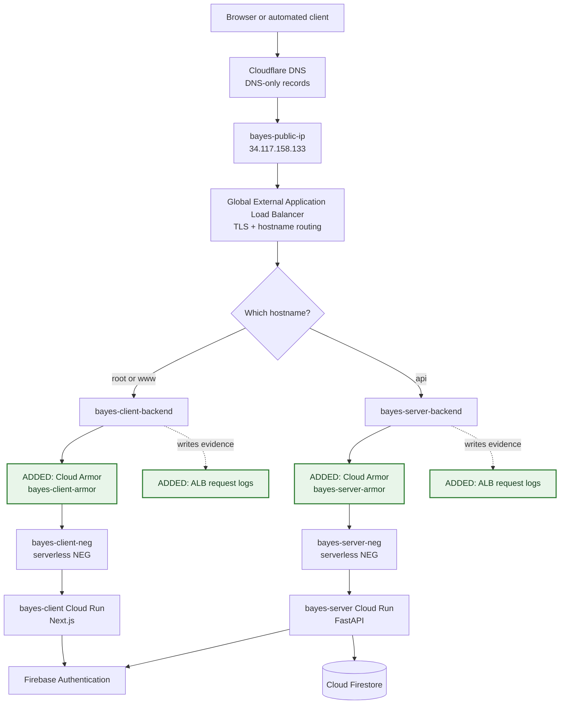
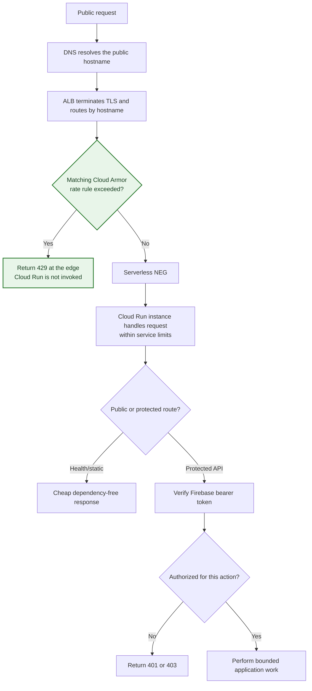
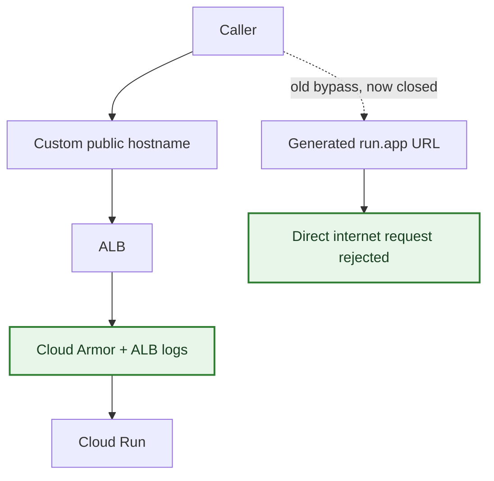
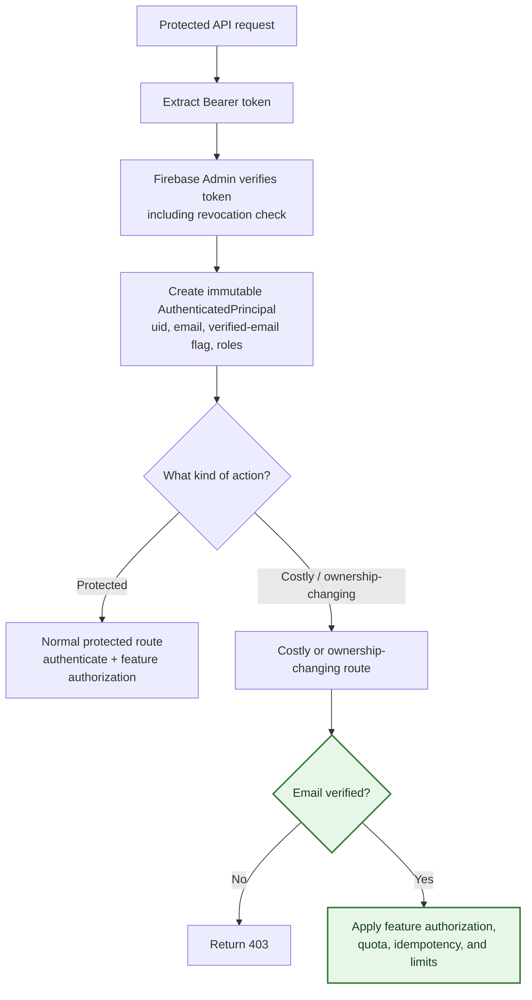
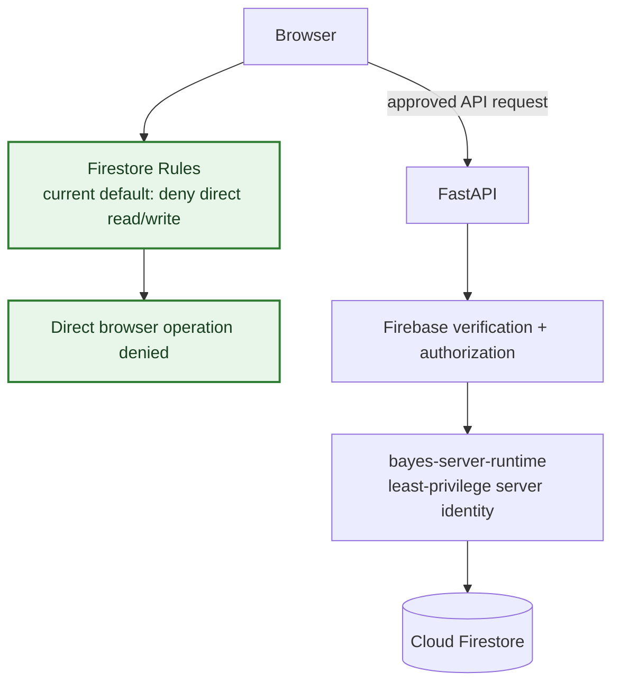
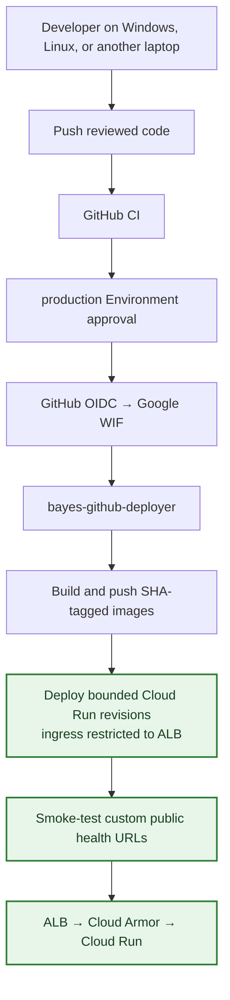

# Bayes Learning Platform — Public Abuse, Cost Hardening, and the Next Architecture Layer

> **Purpose.** This is the companion learning document to [Cloud Architecture, What We Built, and New-Machine Setup](01_bayes-cloud-architecture-and-machine-setup.md). The first document explains how Bayes became a production system. This one explains the next question: now that it is public, how do we stop ordinary abuse, mistakes, and traffic spikes from becoming unbounded work or spend?
>
> It is deliberately not a command-by-command runbook. The completed operational work is recorded in [Public Abuse and Cost-Resistance Runbook](../02_PUBLIC_ABUSE_AND_COST_HARDENING.md). Here, the goal is to preserve the mental model: what changed, why it belongs where it does, what it protects, and what still needs a human decision as the product grows.
>
> Current production project: `bayes-institute`<br>
> Primary region: `asia-south1`<br>
> Canonical client origin: `https://www.bayesinstitute.com`<br>
> Canonical API origin: `https://api.bayesinstitute.com`

---

## 1. The short version: the architecture did not change shape — it gained guardrails

The base architecture still survives exactly as designed:

```text
Browser → Cloudflare DNS → Google global load balancer → serverless NEG → Cloud Run
```

The hardening work did not add another application server, move Firebase, or change the deployment model. It added controls around the existing public entrance and made the Cloud Run services less willing to do unlimited work.

The important additions are:

1. **Cloud Armor policies on each load-balancer backend** reject excess requests before a serverless NEG invokes Cloud Run.
2. **Load-balancer request logging** makes those decisions visible, so rate limits can be tuned using evidence rather than guesswork.
3. **Cloud Run ingress is load-balancer-only**, so the generated `run.app` service URL is not a bypass around Armor and ALB logging.
4. **Cloud Run limits are declared in CD**: minimum instances, maximum instances, concurrency, memory, CPU, and timeout are reasserted on every production deployment.
5. **Firebase/Firestore and application boundaries are clearer**: direct browser Firestore access is deny-by-default, and FastAPI has a reusable verified-email boundary for future costly or ownership-changing operations.
6. **Billing and operational signals exist as an early-warning system**, not as a magical spending ceiling.

That is the central lesson: public safety comes from **several small, correctly placed limits**, not one “security setting.”

## 2. The updated public request path

The green nodes are the additions to the architecture in the first document. Everything else is the same public delivery path already in place.



Two details are easy to miss:

- Cloud Armor is attached to a **backend service**, not “in front of Google Cloud” as a vague global switch. The hostname router chooses the client or API backend first; the matching policy then evaluates the request before the serverless NEG can send work to Cloud Run.
- There are **two independent policies**. The client’s normal asset/navigation pattern is different from the API’s pattern. Separating them avoids spending the API’s protection budget on ordinary web-page traffic.

## 3. What a request can now do

The main path still succeeds, but it must now pass more deliberately placed checks.



This diagram distinguishes three questions that are often accidentally collapsed:

| Question | Layer that answers it | Example result |
| --- | --- | --- |
| Is this source sending too much traffic? | Cloud Armor | `429 Too Many Requests` before Cloud Run runs. |
| Is there enough permitted compute to start/serve work? | Cloud Run instance and concurrency limits | Queueing, controlled unavailability, or a capacity signal rather than unbounded scaling. |
| May this particular person do this operation? | Firebase verification plus FastAPI authorization | `401` for no/invalid identity, `403` for an identity without permission. |

Rate limiting is deliberately first because it is the cheapest place to decline unnecessary work. Authentication is still essential because an attacker who stays below an IP rate limit is not therefore an authorized learner.

## 4. Cloud Armor: an edge cost control, not a user quota

Cloud Armor gives the load balancer a chance to decline a request before Cloud Run starts a container, verifies a token, queries Firestore, or calls a future paid service. This is why it reduces both abuse risk and cost exposure.

The initial policy design separates route classes:

| Backend | Route class | Initial per-source-IP limit | Why it is different |
| --- | --- | ---: | --- |
| `bayes-client-backend` | `POST /api/auth/session` | 10 per 60 seconds | Session creation verifies a Firebase token and should not be repeatedly driven by a script. |
| `bayes-client-backend` | Other client traffic | 240 per 60 seconds | Normal navigation and static assets need more room than session minting. |
| `bayes-server-backend` | `/health` | 30 per 60 seconds | Health must remain cheap and observable, but cannot be an unlimited anonymous workload. |
| `bayes-server-backend` | Other API traffic | 60 per 60 seconds | API routes are the likely path to future database or third-party work. |

Those values are **starting thresholds, not product promises**. The right number is learned from real traffic, especially shared school, library, or mobile-carrier IP addresses. A rate limit that feels secure but blocks an entire classroom is not a successful control.

The policies key on the source IP seen by the Google load balancer. That is meaningful in the current **Cloudflare DNS-only** design, because Cloudflare is not proxying HTTP traffic. If Cloudflare proxying is introduced later, the apparent source-IP model changes and these rules must be reconsidered before they are trusted.

### What Armor does not solve

Cloud Armor is not a Firebase-user quota. A distributed botnet can use many IP addresses, and a legitimate shared IP can represent many people. It also cannot decide whether a user may read another learner’s data. Those are application and data-authorization questions.

For that reason, a future expensive feature still needs its own per-user/day limit, payload limit, timeout, idempotency or attempt constraint, cost estimate, and audit trail. The edge control buys time and prevents obvious floods; it does not make an expensive endpoint automatically safe.

Preconfigured WAF signatures are intentionally a later, preview-first decision. They can help identify common web-attack patterns, but lesson text, URLs, or future rich content can create false positives. A WAF rule is never a substitute for parameterized queries, output encoding, or server-side validation.

## 5. Closing the `run.app` bypass

Before hardening, a caller could reach a generated Cloud Run URL directly. That meant the logical public entrance was the load balancer, but it was not yet the **only** public entrance.



Both services now use `internal-and-cloud-load-balancing` ingress. The ALB can still forward public browser traffic because the services remain `--allow-unauthenticated`; that setting means “the application accepts an invocation delivered by the authorized ingress,” not “the API trusts the browser.” Firebase token verification and authorization remain the next boundary.

This is a useful pattern to remember: **public does not mean directly reachable from every address on every component**. A service can be publicly useful while still having one controlled entry point.

## 6. Cloud Run now has a bounded work envelope

The deployment workflow makes the capacity choices visible and repeatable:

| Service | Minimum instances | Maximum instances | Concurrency | CPU / memory | Request timeout |
| --- | ---: | ---: | ---: | --- | --- |
| `bayes-client` | 0 | 3 | 40 | 1 vCPU / 512 MiB | 300 seconds |
| `bayes-server` | 0 | 3 | 20 | 1 vCPU / 512 MiB | 300 seconds |

`min = 0` retains scale-to-zero economics when the platform is idle. `max = 3` prevents one public surge from creating an unbounded number of instances. Concurrency lets each instance serve a bounded number of simultaneous requests, and the API’s lower setting acknowledges that API work is more likely to involve authentication and data access.

The maximum is a **cost-and-availability trade-off**, not a performance bug to remove. During a surge it may produce queueing or failed requests. That is preferable to silently expanding compute and downstream pressure until the billing or data system becomes the next failure.

The key operational improvement is not merely that these values were configured once in the console. CD passes them explicitly on every `gcloud run deploy`. A later release therefore does not accidentally undo the hardening just because a developer deployed a new image.

## 7. Authentication is still the application’s decision layer

The original architecture already required FastAPI to derive the principal from a Firebase-verified bearer token. That remains the normal protected-route boundary. The hardening work makes one additional distinction explicit: some future operations should require a verified email address as well.



`require_verified_email` is now available as a tested FastAPI dependency. It builds on, rather than replaces, `require_authenticated_principal`:

```text
valid Firebase token
        ↓
AuthenticatedPrincipal
        ↓
verified email required only where the route chooses it
```

That nuance matters. The helper does not retroactively make every existing route require a verified email, and verified email by itself does not grant a role or entitlement. A future expensive route should opt into this stricter dependency and still implement its own authorization and quota rules.

## 8. Firestore is deliberately closed to direct browser traffic

The repository now carries a versioned `firestore.rules` source and a protected production deployment workflow. Its current rule is intentionally simple: direct reads and writes to the default Firestore database are denied.



This does not mean Firestore is unusable. It means that, today, all data access must pass through a server boundary where identity, authorization, and future feature-cost limits can be enforced deliberately.

When a browser-direct Firestore feature is genuinely needed, it is a new design task: write narrowly scoped rules, test them, deploy them through the versioned process, and introduce Firebase App Check in observation mode before enforcement. Do not weaken the deny-all rule simply to make a prototype convenient.

## 9. Budgets and logs make the architecture observable, not invincible

A monthly budget named `Bayes public-launch monthly ceiling` is set to ₹1,000 for this project, with actual and forecast notifications at 20%, 50%, 80%, and 100%. The important interpretation is:

```text
Budget notification ≠ hard billing stop
```

It creates time for a human decision. Automatic billing disablement would shut down the entire product and should only be introduced with a tested recovery procedure and explicit owner agreement. Cost-anomaly notifications and an independent notification recipient should also be verified as part of maintaining public readiness; alerts that only reach an unavailable owner are not a resilient control.

The load balancer records 100% of requests while public traffic is new and Armor limits are being learned. This is intentionally more observability than the long-term steady state may need. Once a normal baseline exists, logging can be sampled thoughtfully while retaining security-policy and error visibility.

Never turn observability into a data leak. Request logs must not contain bearer tokens, session cookies, authorization headers, raw request bodies, Firestore documents, learner answers, or other sensitive application content.

## 10. Which work belongs to the cloud, the deployment workflow, and a laptop?

This distinction from the first document matters even more after hardening.

| Kind of work | Examples from this chapter | What happens when you get a new laptop? |
| --- | --- | --- |
| **One-time cloud state** | Cloud Armor policies, their attachment to backend services, ALB logging, a billing budget, monitoring/alert configuration | It remains in Google Cloud. Inspect it; do not recreate duplicates. |
| **Versioned, continuously asserted state** | Cloud Run ingress, min/max instances, concurrency, memory, timeout, production health-check target, Firestore Rules source | It lives in Git and is reapplied by protected GitHub CD. A new laptop only needs Git access to contribute changes. |
| **Ongoing operational judgement** | Armor threshold tuning, WAF preview decisions, log sampling, anomaly recipient testing, quota choices, incident response | It is not “finished forever.” Revisit it with evidence as real traffic and features change. |
| **Per-machine setup** | `gcloud auth login`, `gcloud config set project`, repository clone, local ADC or secured credentials, ignored `.env` files | Repeat it on every Windows, Linux, or replacement machine. It does not alter the production architecture by itself. |

The same laptop-independent principle still applies: production continues when every laptop is off. Cloud resources, GitHub workflows, Cloud Run revisions, IAM, Firestore rules releases, and the load balancer are not hosted on the development machine.

## 11. What changed in the delivery flow

The deployment path is still GitHub CI → protected production approval → OIDC/WIF → deployment identity → Artifact Registry → Cloud Run. The difference is that a normal deployment now preserves the public boundaries as part of the release.



The custom-domain smoke tests are an architectural assertion. Testing `https://www.bayesinstitute.com/health` and `https://api.bayesinstitute.com/health` confirms the production entry point, rather than silently validating an internal/direct `run.app` path that users should no longer reach.

## 12. A practical way to reason about a future endpoint

Before approving a new public route, classify it by the most expensive thing it can make the platform do.

| Route type | Examples | Baseline expectation |
| --- | --- | --- |
| Cheap | Health check, static landing content | No database or third-party work; edge rate limit. |
| Identity | Session create/delete, sign-in callback | Same-origin protection, Firebase verification, low edge rate limit, audit visibility. |
| Learner read | Profile, progress, published lesson | Authentication, ownership checks, pagination, read-cost estimate, per-user bound when needed. |
| Learner write | Answer submission, progress update | Authentication, authorization, idempotency or attempt constraint, bounded reads/writes. |
| Expensive | Upload, search, reporting, AI, exports, payments | Verified identity where appropriate, per-user/day quota, payload cap, timeout, concurrency cap, cost estimate, audit event, product-owner approval. |

The question is not merely “does it work?” It is also “what prevents one browser or one valid account from making it run forever, run in parallel, or repeat the same paid operation?”

## 13. How to inspect rather than recreate from another machine

On a replacement Linux laptop, authenticate as the authorized human operator, set the same project and region, then use read-only inspection to rebuild confidence in the live state:

```bash
export PROJECT_ID="bayes-institute"
export REGION="asia-south1"

gcloud compute backend-services describe bayes-client-backend \
  --global --project="$PROJECT_ID" \
  --format="yaml(name,securityPolicy,logConfig)"

gcloud compute backend-services describe bayes-server-backend \
  --global --project="$PROJECT_ID" \
  --format="yaml(name,securityPolicy,logConfig)"

gcloud compute security-policies rules list \
  --security-policy=bayes-client-armor --project="$PROJECT_ID"

gcloud compute security-policies rules list \
  --security-policy=bayes-server-armor --project="$PROJECT_ID"

gcloud run services describe bayes-client \
  --region="$REGION" --project="$PROJECT_ID"

gcloud run services describe bayes-server \
  --region="$REGION" --project="$PROJECT_ID"
```

These commands inspect a shared cloud system. They do not create a new policy, service, or billing resource merely because the operator has changed machines.

For the exact one-time commands, validation criteria, rate-limit change procedure, and incident response sequence, use the operational runbook rather than improvising changes from this learning document.

## 14. The architecture in one sentence, updated

**A developer pushes independently buildable Next.js and FastAPI applications to GitHub; protected CI/CD deploys bounded, scale-to-zero Cloud Run revisions through keyless OIDC/WIF, while all public traffic enters one TLS-enabled global load balancer, passes through a backend-specific Cloud Armor policy and observable request path before reaching Cloud Run, and relies on Firebase authentication, FastAPI authorization, deny-by-default Firestore Rules, and human-reviewed cost signals for the controls the edge cannot provide.**

## 15. What remains intentionally unfinished

Hardening is a practice, not a final switch. The following are deliberately future decisions rather than work to copy blindly today:

- Tune Armor thresholds only from representative traffic and shared-IP evidence; preview any new WAF signature before enforcement.
- Verify that budget/anomaly alerts reach an independent, monitored recipient and rehearse the response path.
- Add Firebase App Check when a browser-direct Firebase feature needs it; monitor first, then enforce after legitimate clients are proven to work.
- Give every new database, upload, export, search, AI, or payment feature its own cost controls at design time.
- Review the bounded Cloud Run settings when measured product demand changes — never raise capacity merely because a spike is uncomfortable.

The completed work has given Bayes a controlled public entrance. Keeping it safe now means preserving these boundaries as the application becomes more capable.
